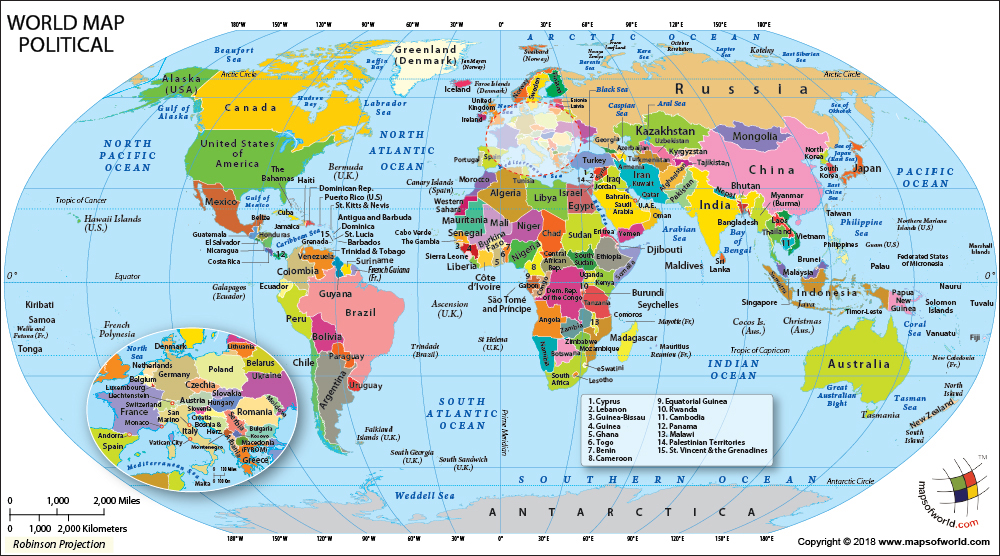

#Goal today: Use R Markdown to investigate a data question! 

These data are originally from Kaggle (https://www.kaggle.com/dorbicycle/world-foodfeed-production).
Laurel Brehm has done some reformatting & cleaning, & has uploaded the results to RLadies GitHub.

The data were collected from Food and Agriculture Organization of the United Nations.
We have production in 1000 tonnes of *food* (=for people) and *feed* (=for animals), per country over years.
There is also data about the country location (latitude and longitude).

```{r echo=F}
### Here are the data cleaning commands I ran.
### you don't need to also run these, you can skip straight to reading in FAO2.csv
### that's why these are commented out with the # characther
### this makes the computer ignore these commands
### make sure if you do run these to detach plyr afterwards as it causes issues with dplyr. 

# library(reshape2)
# library(plyr)
# library(stringr)
# 
# ds <- read.csv('FAO.csv')
# ## In the original the year variable is what's known as 'wide', wheras the other variables are 'long'. Make year long too.
# ds <- melt(ds,measure.var=11:63,variable.name="Year",value.name="KTonnes")
# ## and make the year variable into a number, by taking off the Y and treating as a number
# ds$Year <- as.numeric(substr(ds$Year,2,5))
# 
# ## Make a new variable that categorizes types of crops
# ## I am doing this in several steps.
# ds$Crop <- as.character(ds$Item)
# ## first find common strings and use regex to recode
# ds[str_detect(ds$Crop,"Fish")==T,]$Crop<-"Seafood"
# ds[str_detect(ds$Crop,"Oil")==T,]$Crop<-"Oil"
# ds[str_detect(ds$Crop,"Alcohol")==T,]$Crop<-"Alcohol"
# ds[str_detect(ds$Crop,"Meat")==T,]$Crop<-"Meat"
# ds[str_detect(ds$Crop,"meat")==T,]$Crop<-"Meat"
# ds[str_detect(ds$Crop,"Animal")==T,]$Crop<-"Meat"
# ds[str_detect(ds$Crop,"Offals")==T,]$Crop<-"Meat"
# ds[str_detect(ds$Crop,"Sugar")==T,]$Crop<-"Sugar"
# ds[str_detect(ds$Crop,"Nuts")==T,]$Crop<-"Nuts"
# ds[str_detect(ds$Crop,"nuts")==T,]$Crop<-"Nuts"
# ds[str_detect(ds$Crop,"Roots")==T,]$Crop<-"Roots"
# ds[str_detect(ds$Crop,"seed")==T,]$Crop<-"Seeds"
# ds[str_detect(ds$Crop,"fruit")==T,]$Crop<-"Fruit"
# ds[str_detect(ds$Crop,"Fruit")==T,]$Crop<-"Fruit"
# ds[str_detect(ds$Crop,"otatoes")==T,]$Crop<-"Starch"
# ds[str_detect(ds$Crop,"beans")==T,]$Crop<-"Beans"
# 
# ## Get rid of all the string ', Other'
# ds$Crop <- str_replace(ds$Crop,', Other','')
# ## Get rid of the all the strings ' and products'
# ds$Crop <- str_replace(ds$Crop,' and products','')
# 
# ## now make a factor
# ds$Crop <- as.factor(ds$Crop)
# 
# ## now use successive applications of the 'revalue' function to re-categorize things where I can't use a regex
# ds$Crop <- revalue(ds$Crop,c("Beer"="Alcohol", "Wine"="Alcohol", "Beverages, Fermented"="Alcohol"))
# ds$Crop <- ds$Crop <- revalue(ds$Crop,c("Barley"="Grains","Cereals - Excluding Beer"="Grains","Cereals"="Grains","Maize"="Grains","Millet"="Grains","Rice (Milled Equivalent)"="Grains","Oats"="Grains","Rye"="Grains","Sorghum"="Grains","Wheat"="Grains"))
# ds$Crop <- revalue(ds$Crop,c("Cephalopods"="Seafood", "Crustaceans"="Seafood", "Molluscs"="Seafood", "Aquatic Products"="Seafood"))
# ds$Crop <- revalue(ds$Crop,c("Sweeteners"="Sugar"))
# ds$Crop <- revalue(ds$Crop,c("Butter, Ghee"="Dairy", "Cream"="Dairy", "Milk - Excluding Butter"="Dairy"))
# ds$Crop <- revalue(ds$Crop,c("Cloves"="Spices", "Pepper"="Spices"))
# ds$Crop <- revalue(ds$Crop,c("Apples"="Fruit", "Bananas"="Fruit","Citrus"="Fruit", "Dates"="Fruit","Grapes (excl wine)"="Fruit", "Lemons, Limes"="Fruit","Oranges, Mandarines"="Fruit", "Pineapples"="Fruit"))
# ds$Crop <- revalue(ds$Crop,c("Aquatic Plants"="Veg", "Olives (including preserved)"="Veg","Onions"="Veg", "Palm kernels"="Veg","Peas"="Veg", "Pimento"="Veg","Tomatoes"="Veg","Vegetables"="Veg"))
# ds$Crop <- revalue(ds$Crop,c("Cassava"="Starch", "Plantains"="Starch", "Yams"="Starch"))
#                              
#ds$Unit <- NULL
#ds$Area.Code <- NULL
#ds$Element.Code <- NULL
#ds$Item.Code <- NULL

# write.table(ds,"FAO2.csv",row.names=F,sep=",")

# detach(plyr)  ## because we are using dplyr later and the two don't play nice together.
```

## Data Summary
What do these data look like?

```{r echo=FALSE}
# Here's a new chunk!
# Some notes:  echo=FALSE means 'don't show the code in the output'
# In the R environment, a # is a comment. (in the markdown section, it means 'put in a heading'. try experimenting with # vs ## vs ### to see what this does.)

# Let's start by loading packages
library(dplyr)
library(ggplot2)
library(knitr)  #for pretty output (includes function kable() )

# if you don't have the library installed, use install.packages('Package')
# install.packages('tidyr') 
# easiest to do this in the console


# Let's load in some data and show it
ds <- read.csv('FAO2.csv')  
#this command will work if the data are stored in the same folder

     
# let's actually use the data as a tibble rather than data frame-- nice for summarising
ds <- as_tibble(ds)

head(ds)  # show the top of the data
```

What are the countries? What are the crops & food-stuffs?
```{r echo=FALSE}
#In the top of this chunk, we've asked all of the code and output to be hidden
#We did this by putting echo=FALSE in the top
# To figure out what's in the data, use this command
# levels(data$Column) 
# What are the countries?
levels(ds$Area)

# Make a table of crops by items
# 't0 <- ' is base R. it means 'assign to object t0'
# The rest uses tidyr notation.  %>% is a 'pipe' to pass operations onward.
# ds %>% means 'work within the data set ds, do some stuff to it'
# select means: put these colums in the output
# arrange means: order by crop, then within that, item
t1 <- ds %>% 
  select(Crop,Item) %>%
  arrange(Crop,Item)

#unique is a base R function, it means take just the unique rows.
t1 <- unique(t1)

# print out in a pretty table
kable(t1)


```

## Embed a plot or picture!
```{r out.width='400px', echo=FALSE}
# in this chunk I specified what the output size should be
# and said not to show the R code in the output

```


## Take some stuff from R and put it in text!
```{r echo=TRUE}
# in this chunk, I asked the output to be shown with echo=TRUE 
# Get the maximum value of a product, with function max(). 
# Need to set na.rm=T because there are NA values in the column.
m <- max(ds$KTonnes,na.rm=T)

# Then look up which area has that value for the column KTonnes
a <- ds[ds$KTonnes %in% m ,]$Area

# And which item it is
i <- ds[ds$KTonnes %in% m ,]$Item

# And which year!
y <- ds[ds$KTonnes %in% m ,]$Year

# Then, we can use those values in text by surrounding with `` and prefacing with r
```

The single largest export in a year was from `r a` in `r y` and it was `r m*1000` tonnes of `r i`.

#The goal for today is to investigate food / feed production over time by countries.  
Summarise some data, plot some data, and find some patterns!

##Questions to ask:
- Pick a food type and look at where it's grown over time
- Pick a country and find what's been grown in it over time
- Pick a year and see what's been grown where
- Look at differences in food (for people) vs feed (for animals) for a country or set of countries

## For advanced R users: Go forth on your own from here!  

##For beginners... here are some code chunks to use to get you started. 

#Data Summarising
```{r echo=TRUE}
# in this chunk, I asked everything to be shown with echo=TRUE 
# Here are some useful tabulation commands. These use the tidyverse.
# This takes data and summarises for output. 
# %>% is a 'pipe' and passes commands between lines.

# you can filter columns. here, we want columns where the item is sugar cane, used for food
t2 <- ds %>%
  filter(Item=="Sugar cane") %>%
  filter(Element=="Food")

t2

```

```{r echo=TRUE}
# you can use a | operator ('or') to look at multiple selections at once.
# you can use the select operator to only show some columns
# and the filter operator to remove columns even after summarising
# here we ask for only the crops of more than 10*1000 tonnes
t3<- ds %>%
  filter(Area=="Netherlands" | Area=="Belgium") %>% 
  group_by(Area,Crop,Element,Year) %>%
  summarise(TotalKTonnes = sum(as.numeric(KTonnes)) ) %>%
  filter(TotalKTonnes > 10)

t3
```

```{r echo=TRUE}
# We can make lists and use these to filter. 
# Here's list of some things eaten by people and animals
mixed <- c("Oats","Soyabeans", "Sugar cane")

# this will generate an error, but it actually works. 
#an example of tidyverse 'lazy evaluation'
t4<- ds %>%
  filter(Area=="Brazil" | Area=="Colombia") %>%
  filter(Item==mixed)
  
t4 
```

```{r echo=TRUE}
# finally, we can put these together to summarise.
# Here, we are taking mass of items grown in Brazil or Colombia
# and taking together the sum of all tonnes by year across rows
# (= total production in these countries, whether for food or feed)
# (Note that I used a less lazy evaluaton method here for the filter)

t5<- ds %>%
  filter(Item %in% mixed == T) %>%
  filter(Area=="Brazil" | Area=="Colombia") %>%
  group_by(Year,Item) %>% 
  summarise(TotalKTonnes = sum(as.numeric(KTonnes))  ) 

t5
         
```
\newpage %%newpage is a command for Latex. to see what tfis does, try knitting to pdf, which uses Latex. ...and % is the comment character for Latex.

## Plotting

```{r, echo=T}
# We can easily plot these with lines, points, and bars!
# we are using ggplot here. 
#The first line sets up what the data are & what values are mapped to things
# in the plot ('aes' values).
# variables that are useful include: x, y values, color, lty (=line type)
# we can then add points or lines or bars with geom_point, geom_line, geom_bar

ggplot(data=t5,aes(x=Year,y=TotalKTonnes,color=Item))+
  geom_point()
```
\newpage
```{r echo=TRUE}
# add connector lines
# and make separate panels with facet_grid 
#(explore what the ~ does by trying .~Area vs Area~.)
ggplot(data=t4,aes(x=Year,y=KTonnes,color=Item,lty=Element))+
  geom_point()+
  geom_line()+
  facet_grid(.~Area)
```
\newpage
```{r echo=TRUE, out.width='8000px'}
# Here's an example of a bar plot
# And an example of user-specified figure height / width
ggplot(data=t3,aes(x=Year,y=TotalKTonnes,fill=Crop))+
  geom_bar(stat='identity')+
  facet_grid(Area~.)+
  theme(legend.position="bottom")
```
\newpage

## Tables of output
```{r echo=TRUE}
#Most of what we did earlier was tibbles: 
#this was a concious choice because the data structures were too big.
#Where 'tables' really shine is with summary data.

# here, we make a new  variable with 'mutate'-- the last tibble 'verb'
t6 <- ds %>%
  filter(Item %in% mixed == T) %>%
  filter(Area=="Brazil" | Area=="Colombia") %>%
  mutate(Decade=round(((Year-5)/10),0)*10) %>%  
  # year minus 5, divided by 10, rounded to 0 decimal places.
  # (1969 - 5)/10=196.4, rounds to 1960
  group_by(Decade,Item) %>% 
  summarise(TotalKTonnes = sum(as.numeric(KTonnes))  ) %>%
  arrange(Item,Decade)

t6 <- as.data.frame(t6)

kable(t6)
```

\newpage

```{r echo=TRUE}
#We can also restructure the table
# this uses matrix notation to paste together elements by column
# I've also put the units in tonnes again
kable(cbind(t6[1:6,1],t6[1:6,3]*1000,t6[7:12,3]*1000,t6[13:18,3]*1000),
      col.names=c("Year","Tonnes/Oats","Tonnes/Soya","Tonnes/Sugar Cane"))
```

## Cool!  Adapt these code chunks to ask some questions and make a nice summary of it with Markdown.
